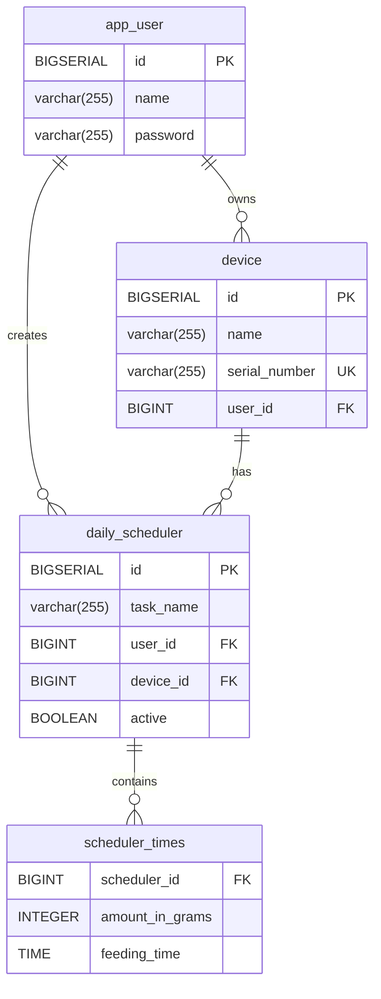

# Cat Feeder Database Schema

## Entity Relationship Diagram

## Tables Overview

### 1. **app_user**
Main user table storing application users.

| Column | Type | Constraints |
|--------|------|-------------|
| id | BIGSERIAL | PRIMARY KEY, NOT NULL |
| name | VARCHAR(255) | NOT NULL |
| password | VARCHAR(255) | NOT NULL |

---

### 2. **device**
Stores cat feeder devices owned by users.

| Column | Type | Constraints |
|--------|------|-------------|
| id | BIGSERIAL | PRIMARY KEY, NOT NULL |
| name | VARCHAR(255) | NOT NULL |
| serial_number | VARCHAR(255) | NOT NULL, UNIQUE |
| user_id | BIGINT | NOT NULL, FK → app_user(id) |

**Foreign Keys:**
- `fk_device_user`: user_id → app_user(id) ON DELETE CASCADE

---

### 3. **daily_scheduler**
Feeding schedules created by users for their devices.

| Column | Type | Constraints |
|--------|------|-------------|
| id | BIGSERIAL | PRIMARY KEY, NOT NULL |
| task_name | VARCHAR(255) | NOT NULL |
| user_id | BIGINT | NOT NULL, FK → app_user(id) |
| device_id | BIGINT | NOT NULL, FK → device(id) |
| active | BOOLEAN | NOT NULL, DEFAULT true |

**Foreign Keys:**
- `fk_scheduler_user`: user_id → app_user(id) ON DELETE CASCADE
- `fk_scheduler_device`: device_id → device(id) ON DELETE CASCADE

---

### 4. **scheduler_times**
Individual feeding times with metadata for each scheduler.

| Column | Type | Constraints |
|--------|------|-------------|
| scheduler_id | BIGINT | NOT NULL, FK → daily_scheduler(id) |
| amount_in_grams | INTEGER | NULL |
| feeding_time | TIME | NOT NULL |

**Foreign Keys:**
- `fk_times_scheduler`: scheduler_id → daily_scheduler(id) ON DELETE CASCADE

**Note:** This is a collection table (one-to-many relationship) where each scheduler can have multiple feeding times.

---

## Relationships

1. **app_user → device**: One user can own multiple devices (1:N)
2. **app_user → daily_scheduler**: One user can create multiple schedules (1:N)
3. **device → daily_scheduler**: One device can have multiple schedules (1:N)
4. **daily_scheduler → scheduler_times**: One scheduler can have multiple feeding times (1:N)

## Cascade Delete Behavior

All foreign keys use `ON DELETE CASCADE`, meaning:
- Deleting a user will delete all their devices and schedulers
- Deleting a device will delete all its schedulers
- Deleting a scheduler will delete all its feeding times

## Recent Changes

### Changelog 004 (November 2025)
The `scheduler_times` table was refactored to include feeding metadata:
- Added `amount_in_grams` column to specify food amount per feeding
- Renamed `scheduled_time` to `feeding_time` for clarity
- Maintained the relationship with `daily_scheduler`

